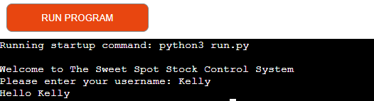
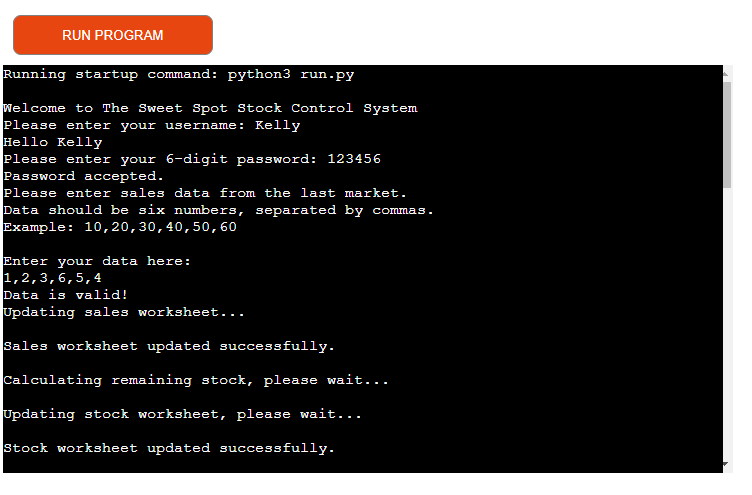
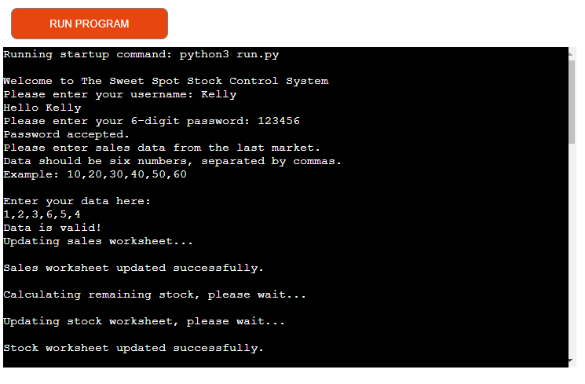
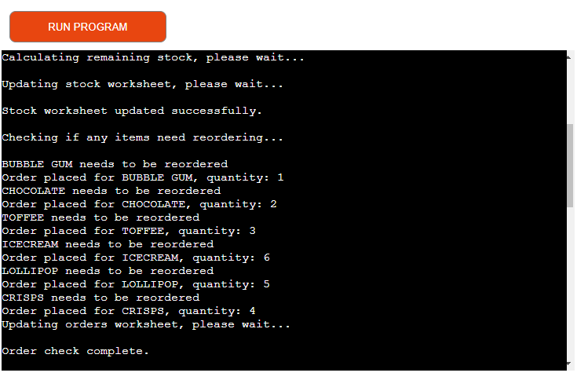
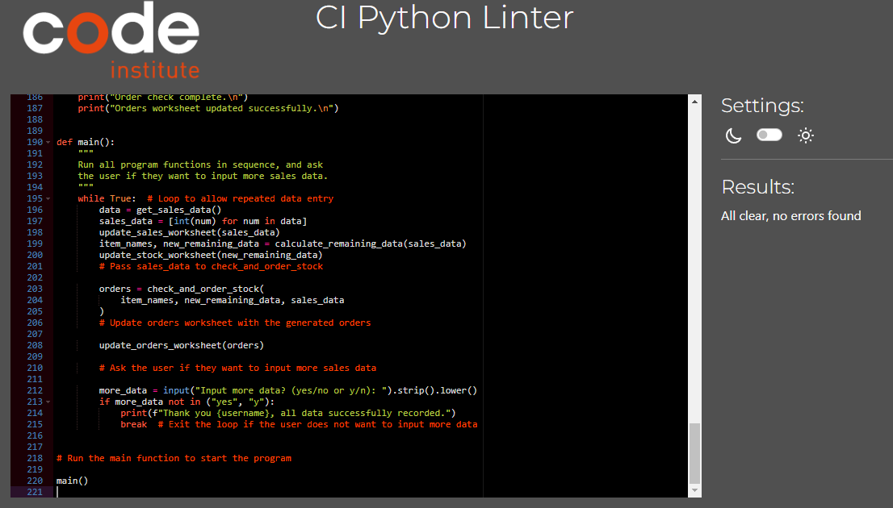

# The Sweet Spot Stock Control System

Welcome to The Sweet Spot Stock Control System, a Python-based application that allows you to manage sales data and stock levels for a corner shop. This system helps you update sales, calculate remaining stock, and place orders for items that need restocking.

####
****

Visit the deployed site here: [Sweet Spot Stock Control System](https://the-sweet-spot-77d7895edf47.herokuapp.com/e-21cf1bd3f380.herokuapp.com/)

# Contents

- [Contents](#contents)
    - [Client Goals](#client-goals)
- [Design](#design)
    - [Flowcharts](#flowcharts)
- [Features](#features)
  - [Existing Features](#existing-features)
    - [Username Validation](#username-validation)
    - [Password Validation](#password-validation)
    - [Sales Data Input](#sales-data-input)
        - [Sales Data Validation](#sales-data-validation)
        - [Sales Data Update](#sales-data-update)
    - [Stock Management](#stock-management)
        - [Stock Data Calculation](#stock-data-calculation)
        - [Stock Data Update](#stock-data-update)
    - [Order Management](#order-management)
        - [Order Check and Placement](#order-check-and-placement)
        - [Orders Update](#0rderrs-update)
- [Future Implementations](#future-implementations)
- [Technologies Used](#technologies-used)
- [Deployment](#deployment)
- [Testing](#testing)
- [Code Used](#code-used)
- [Content](#content)
- [Media](#media)
- [Other](#other)
- [Acknowledgements](#acknowledgements)
- [Back to top](#Back-to-top)

### Client Goals

Efficient Stock Management: Streamline the process of tracking sales and stock levels to ensure inventory is accurately maintained.
Automated Reordering: Automatically determine and place orders for items that need restocking to avoid shortages.
User-Friendly Interface: Provide a simple and intuitive interface for users to input sales data and manage inventory.
Data Integrity: Ensure the data entered is valid and correctly updated in the Google Sheets worksheets.

### Features

User Authentication

Username Validation: Ensures the username contains only letters.

Password Validation: Ensures the password is exactly 6 digits.

Sales Data Management
Sales Data Input: Prompts the user to enter sales data in a specific format (six numbers separated by commas).

Sales Data Validation: Checks if the sales data input is valid (six numeric values).

Sales and Stock Data Update: Updates the sales worksheet in Google Sheets with the new sales data.
Calculates the remaining stock by subtracting sales data from the latest stock data.
Stock Data Update: Updates the stock worksheet in Google Sheets with the new stock data.

Order Management
Order Check and Placement: Checks if any items need reordering based on remaining stock (if stock is less than 10) and places orders if necessary.
Orders Update: Updates the orders worksheet in Google Sheets.

## Future Implementations

User Authentication Enhancements:
Implement user roles and permissions.
Add password encryption for enhanced security.
Enhanced Data Analysis:
Provide detailed sales and stock reports.
Include data visualization for better insights.
Notification System:
Send alerts when stock levels are low.
Notify users of successful updates and placed orders.

## Design
## Flowcharts

- The flowchart was created using Lucidchart

### Python Validation

#
## Languages Used

This program was written using Python.

## Technologies Used

- Github - To save and store files
- Heroku - To deploy and run the live project
- Markdown Table Maker - to produce the tables used, in this README, from an Excel format
- Lucid (https://lucid.app/)- to produce the flowchart
- PEP8 - to validate the Python code, improving the readability and consistency

The Python libraries used are:

- gspread - an API for Google Sheets
- google.oauth2.service_account - allows the program to access data    
  held in Google Sheets
- regex - checks for patterns in a string 

## Deployment

This site is deployed using Heroku and following these steps:

1. Create a [Heroku](https://id.heroku.com/login) account or, if you already have one, sign in
2. Click the 'new' button and select 'create new app'
3. Enter a unique name for your app and choose the region you are in
4. Click 'create app'
5. Click 'settings' and scroll down to 'Config Vars'. Click 'reveal Config Vars'
6. In the box with the text 'KEY' type PORT and 8000 in the box with the text 'VALUE'
7. Scroll to the next section, buildpacks and click 'add buildpack'. Add Python and NodeJS, in that order. Click 'Add Buildpack'
8. Scroll back to the top of the page and click 'Deploy'
9. Scroll to the Deployment method and choose Github
10. In the next section, Connect to Github, type in your repository name. If you press the search button it'll bring up all your repositories. Connect to the correct repository
11. Scroll down to the two sections for deployment (automatic deploys or manual deploys). The automatic deplays will update each time the 'git push' command is entered. For the maunal deploy, this will deploy the branch specified, in it's current state, when the 'Deploy Branch' button is clicked 

## Testing and Bugs

Please refer to the testing information in the seperate [TESTING.md](/TESTING.md) file, for tests carried out and bugs encountered in this program

## Code Used

The lines from 7 to 18 were taken from the Code Institute Essentials project:

SCOPE = [
    "https://www.googleapis.com/auth/spreadsheets",
    "https://www.googleapis.com/auth/drive.file",
    "https://www.googleapis.com/auth/drive",
]

CREDS = Credentials.from_service_account_file("creds.json")
SCOPED_CREDS = CREDS.with_scopes(SCOPE)
GSPREAD_CLIENT = gspread.authorize(SCOPED_CREDS)
SHEET = GSPREAD_CLIENT.open("corner-shop")

## Other

I used the following resources to expand my knowledge of Python:

- geeksforgeeks.org
- stackoverflow.com
- youtube.com
- w3resource.com
- github.com
- regexr.com
- chatGPT.com
- Python Linter

## Acknowledgements

- My tutor, Marko Tot, for his advice and guidance
- The Code Institute Slack community

________________________________________
This README provides an overview of the current features, client goals, and potential future enhancements for The Sweet Spot Stock Control System. The system is designed to automate and simplify stock management, ensuring efficient operations and minimizing manual errors.

# Back to top