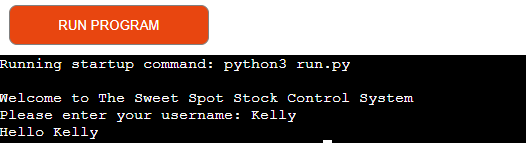
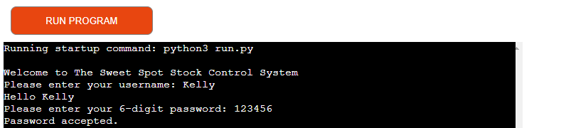
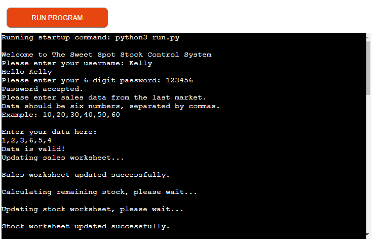
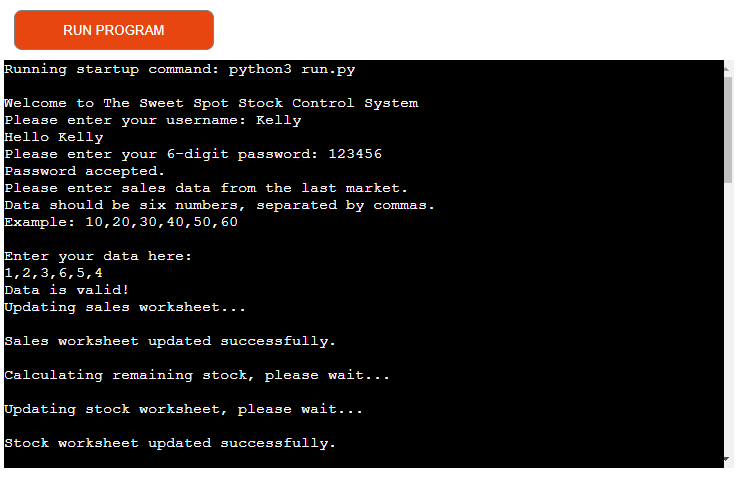
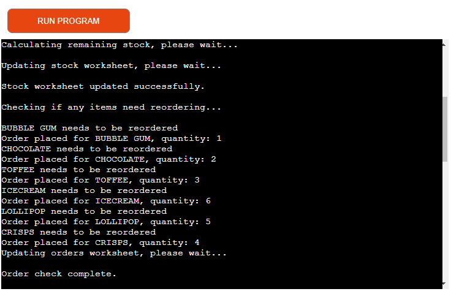
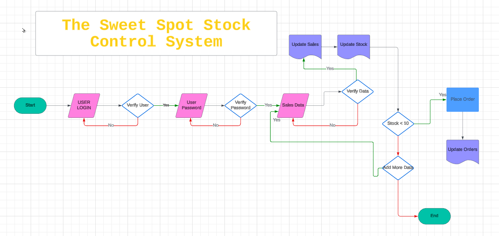
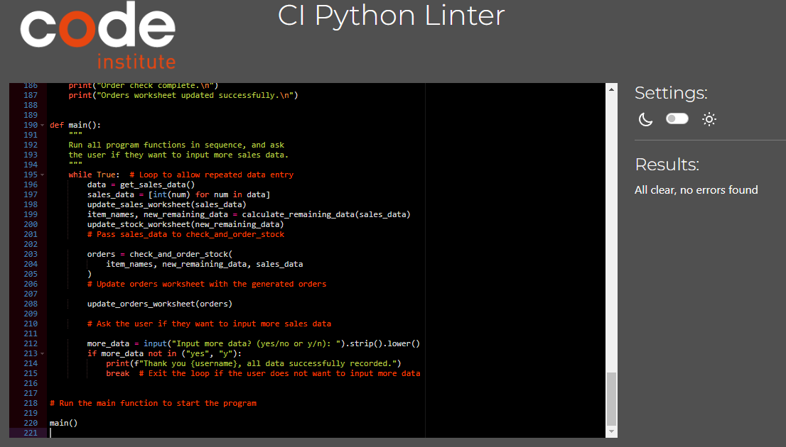

# The Sweet Spot Stock Control System

Welcome to The Sweet Spot Stock Control System, a Python-based application that allows you to manage sales data and stock levels for a corner shop. This system helps you update sales, calculate remaining stock, and place orders for items that need restocking.

####
****

Visit the deployed site here: [Sweet Spot Stock Control System](https://the-sweet-spot-77d7895edf47.herokuapp.com/e-21cf1bd3f380.herokuapp.com/)

# Contents

- [Contents](#contents)
    - [Client Goals](#client-goals)
- [Design](#design)
    - [Flowcharts](#flowcharts)
- [Features](#features)
  - [Existing Features](#existing-features)
    - [Username Validation](#username-validation)
    - [Password Validation](#password-validation)
    - [Sales Data Input](#sales-data-input)
        - [Sales Data Validation](#sales-data-validation)
        - [Sales Data Update](#sales-data-update)
    - [Stock Management](#stock-management)
        - [Stock Data Calculation](#stock-data-calculation)
        - [Stock Data Update](#stock-data-update)
    - [Order Management](#order-management)
        - [Order Check and Placement](#order-check-and-placement)
        - [Orders Update](#0rderrs-update)
- [Future Implementations](#future-implementations)
- [Technologies Used](#technologies-used)
- [Deployment](#deployment)
- [Testing](#testing)
- [Credits](#credits)
  - [Code Used](#code-used)
  - [Content](#content)
  - [Media](#media)
  - [Other](#other)
  - [Acknowledgements](#acknowledgements)

## Client Goals

Efficient Stock Management: Streamline the process of tracking sales and stock levels to ensure inventory is accurately maintained.
Automated Reordering: Automatically determine and place orders for items that need restocking to avoid shortages.
User-Friendly Interface: Provide a simple and intuitive interface for users to input sales data and manage inventory.
Data Integrity: Ensure the data entered is valid and correctly updated in the Google Sheets worksheets.

### Features

User Authentication

Username Validation: Ensures the username contains only letters.

Password Validation: Ensures the password is exactly 6 digits.

Sales Data Management
Sales Data Input: Prompts the user to enter sales data in a specific format (six numbers separated by commas).

Sales Data Validation: Checks if the sales data input is valid (six numeric values).

Sales and Stock Data Update: Updates the sales worksheet in Google Sheets with the new sales data.
Calculates the remaining stock by subtracting sales data from the latest stock data.

Stock Data Update: Updates the stock worksheet in Google Sheets with the new stock data.

Order Management
Order Check and Placement: Checks if any items need reordering based on remaining stock (if stock is less than 10) and places orders if necessary.

Orders Update: Updates the orders worksheet in Google Sheets with 

# Design
## Flowcharts

- The flowchart was created using Lucidchart

### Python Validation

### Landing Page

- The landing page is the page the user lands on when the program is first run
- There is a logo that explains, to the user, what the program does
- The user must input either N or E to choose if they are a new or existing user
- The user is able to input N or E in either upper or lowercase format
- If any other entry is made, the user will see an error message displayed and be asked to enter the information again:

### Main Menu

- User Login

### Enter Data

- The user is 

- The screen will then clear and ask the user to enter a transaction category, from the following options;
    - 1 - Household Bills
    - 2 – Transportation
    - 3 – Food
    - 4 – Savings
    - 5 – Personal Spending
    - 6 – Other
- These categories were chosen as the main categories cover the main area that the majority of people spend in and the other section covers anything that doesn’t fit into these categories
- The option is validated to check the input is a number between 1 and 6
- If an incorrect option is inputted I decided the user should see the whole menu again. This is as there are several options and, if the screen moves past the initial menu being displayed, the user may not remember what the options are.

- When a valid option is chosen, the screen will clear and the user is asked to enter a description of the spend. This can only contain letters
- I considered putting a validation on the length of characters but, decided against this, as some users may not want to write a description 

- When a valid description is entered, the screen will clear, and the user will be asked to enter the spend amount 
- This is validated to check an amount that is either an integer, or to two decimal places is entered and that the amount is greater than zero
- The user will get a message to say their transaction is being added and then a thank you message, using their name, to say that the transaction has been added
- I considered putting a delay, between the adding transaction and the thank you message. I decided against this as, with this type of program, I believe speed would be more important to the user, especially if they are adding multiple transactions

- The users transaction will be appended, as a row, to the bottom of their named Google worksheet, the screen will clear and then user will be asked for their [next choice](#next-choice)

### Analyse Spending

- If the user selects 2 from the [main menu](#main-menu) the screen will clear and they will be asked to enter a start date and end date. Each of these dates is validated the same way as the date for entering a [transaction](#enter-transaction)
- The date range will be validated to ensure that the end date is within 90 days of the start date and that the end date isn’t before the start date

- If the dates entered are valid, the screen will clear and the user will be asked if they would like to see the sum or mean of their spending 
- The option is validated to make sure the user only inputs 1 or 2
- The dates the user has chosen will be displayed and the pivot table will be displayed for whichever of the options they have chosen 
- The user will be asked what they would like to do [next](#next-choice)

### View Transactions

- Option 3 from the [main menu](#main-menu) is the option for the user to view their transactions
- They will asked to choose a date range in the same way as they would for [analyse spending](#analyse-spending-gif)
- A pivot table of their spending will be displayed

- The user will be asked what they would like to do [next](#next-choice)

### Next Choice

- The user is asked what they would like to do next from the following options;
    - 1 – Enter another transaction
    - 2 – Return to the main menu
    - 3 – Quit
- If the user selects 1 the screen will clear and they will be taken to the [enter date](#enter-date) part of the getting transaction function
- If the user selects 2 they will be taken back to the [main menu](#main-menu)
- If the user selects 3 they will receive a thank you and goodbye message

### Quit

- If the user chooses to quit the program a message will be shown, thanking them for using the tracker and saying goodbye {name}

## Future Implementations

- Suggest a username, that is not already in use, to the user
- If the user selects they are an existing user, and their username is not found, give an option to select new user
- Allowing the user to enter a name that has characters used in different languages
- Add a forgotten password function – possibly with password hints
- An option to create a budget and tell the user how much budget they have remaining
- For the user to be able to confirm the transaction before it’s posted
- For the user to be able to select a wider date range for analysing spending
- Allow the user to display transactions by spend category
- The ability for the user to delete transactions
- The ability for the user to record any refunds
- Displays of the panda dataframes to be made more visually pleasing
- Bug to be fixed where the user is still able to type while the commands are printing 

[Back to top](#expense-tracker)

# Technologies Used

## Languages Used

This program was written using Python.

## Frameworks, Libraries and Programs Used

- Codeanywhere – To write the code
- Github - To save and store files
- Heroku - To deploy and run the live project
- Markdown Table Maker - to produce the tables used, in this README, from an Excel format
- Mimo - to produce the flowcharts
- PEP8 - to validate the Python code, improving the readability and consistency

The Python libraries used are:

- gspread - an API for Google Sheets
- google.oauth2.service_account - allows the program to access data held in Google Sheets
- regex - checks for patterns in a string 
- datetime - allows dates and times to be manipulated
- colorama - to display the text in different colours
- pwinput - to display the inputted passwords as asterisks
- os - to clear the page on the live program
- time - used to stipulate time between letters showing and to use the sleep function to delay the page clearing 
- sys - used in the function to slowly print text to the screen
- bcrypt - to store the password, in Google Sheets, encrypted
- pandas - to produce the dataframes 
- numpy - used to produce the pivot table displaying the sum of values

[Back to top](#expense-tracker)

# Deployment

This site is deployed using Heroku and following these steps:

1. Create a [Heroku](https://id.heroku.com/login) account or, if you already have one, sign in
2. Click the 'new' button and select 'create new app'
3. Enter a unique name for your app and choose the region you are in
4. Click 'create app'
5. Click 'settings' and scroll down to 'Config Vars'. Click 'reveal Config Vars'
6. In the box with the text 'KEY' type PORT and 8000 in the box with the text 'VALUE'
7. Scroll to the next section, buildpacks and click 'add buildpack'. Add Python and NodeJS, in that order. Click 'Add Buildpack'
8. Scroll back to the top of the page and click 'Deploy'
9. Scroll to the Deployment method and choose Github
10. In the next section, Connect to Github, type in your repository name. If you press the search button it'll bring up all your repositories. Connect to the correct repository
11. Scroll down to the two sections for deployment (automatic deploys or manual deploys). The automatic deplays will update each time the 'git push' command is entered. For the maunal deploy, this will deploy the branch specified, in it's current state, when the 'Deploy Branch' button is clicked 

[Back to top](#expense-tracker)

# Testing

Please refer to the testing information in the seperate [TESTING.md](/TESTING.md) file

# Credits

## Code Used

The lines from 16 to 26 were taken from the Code Institute Essentials project:

SCOPE = [
    "https://www.googleapis.com/auth/spreadsheets",
    "https://www.googleapis.com/auth/drive.file",
    "https://www.googleapis.com/auth/drive"
    ]

CREDS = Credentials.from_service_account_file('creds.json')
SCOPED_CREDS = CREDS.with_scopes(SCOPE)
GSPREAD_CLIENT = gspread.authorize(SCOPED_CREDS)
SHEET = GSPREAD_CLIENT.open('expense-tracker')

On line 604 the regex expression I have used, ^\-?[0-9]+(?:\.[0-9]{2})?$, was taken from the website:

https://stackoverflow.com/questions/51401672/regex-for-validate-number-to-2-decimal-places

## Content

All content was written by Gail Kicks

## Media

There was no media used in this program

## Other

I used the following resources to expand my knowledge of Python:

- geeksforgeeks.org
- stackoverflow.com
- discuss.codecademy.com
- discuss.python.org
- note.nkmk.me
- docs.python.org
- youtube.com
- docs.gspread.org
- www3.ntu.edu.sg
- programiz.com
- w3resource.com
- owasp.org
- github.com
- bobbyhadz.com
- regexr.com
- pypi.org
- realpython.com
- cheatsheetseries.owasp.org
- zetcode.com
- scaler.com
- tutorjoes.in
- tutorialspoint.com
- superuser.com
- sparkbyexamples.com
- saturncloud.io

## Acknowledgements

- My mentor, Graeme Taylor, for his advice and guidance
- The Code Institute Slack community
- Kera Cudmore for her fantastic README presentation and documentation